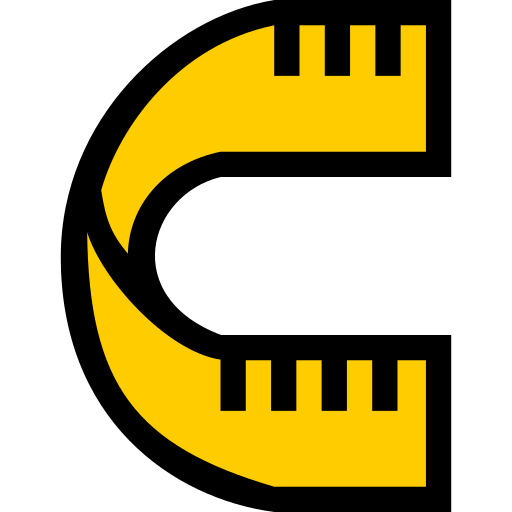
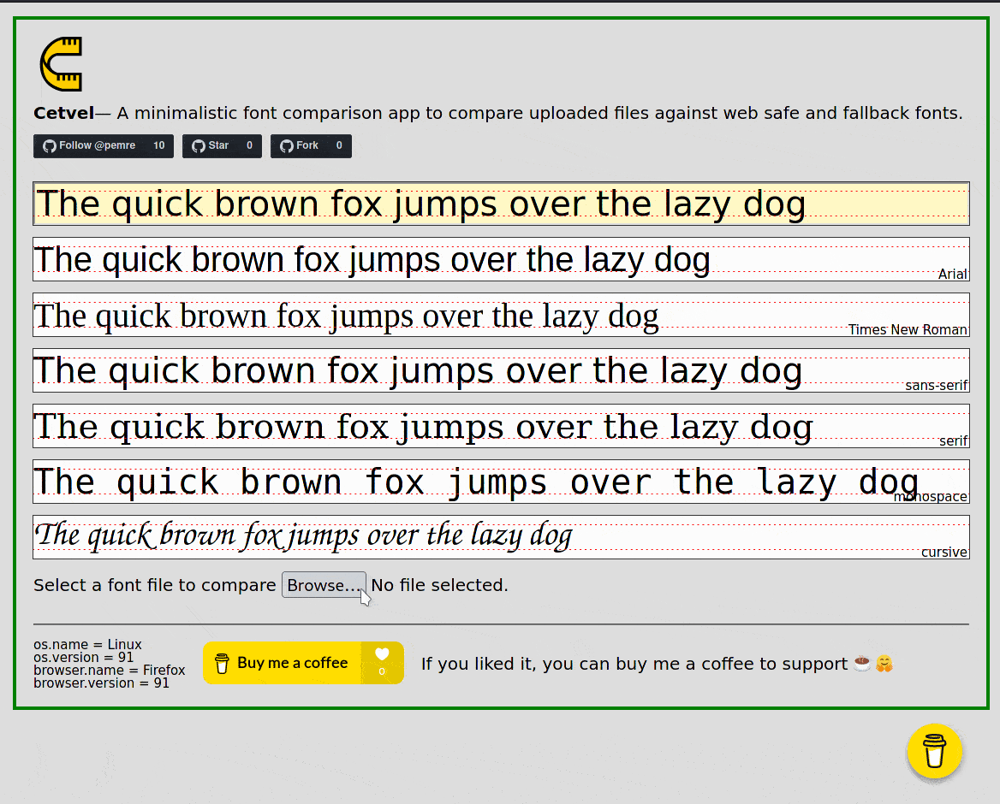

# Cetvel

Cetvel is a minimalistic font comparison app to compare uploaded files against web safe and fallback fonts ("sans-serif", "serif", "monospace", "cursive").

## Meaning

Cetvel (/d͡ʒetvel/) means "ruler" in Turkish. As in ruler (/ruːləʳ/), a long flat piece of wood, metal, or plastic with
straight edges marked in centimetres (or other units). Rulers are used to measure things and to draw straight lines.

## History

It has been developed with the help of [@Potherca](https://github.com/Potherca), while working at Just Eat Takeaway.
We wanted to demonstrate baseline differences of a few fonts. The original version was static without uploading feature.
I fine tuned the original and Cetvel was born.

## Demo

Check out https://pemre.github.io/cetvel/

## Support Me

